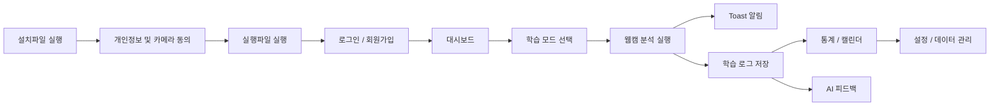
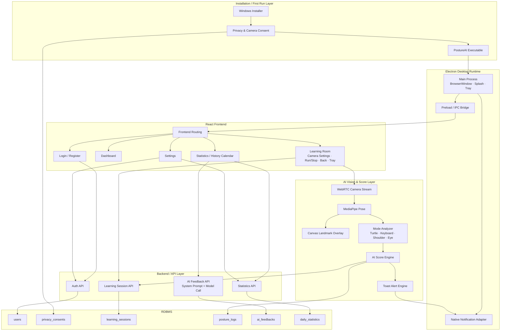
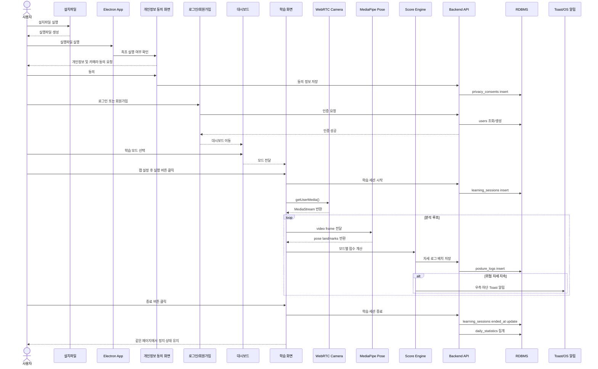
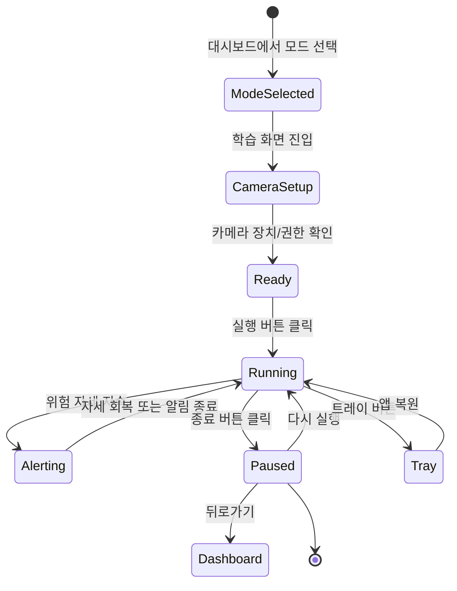
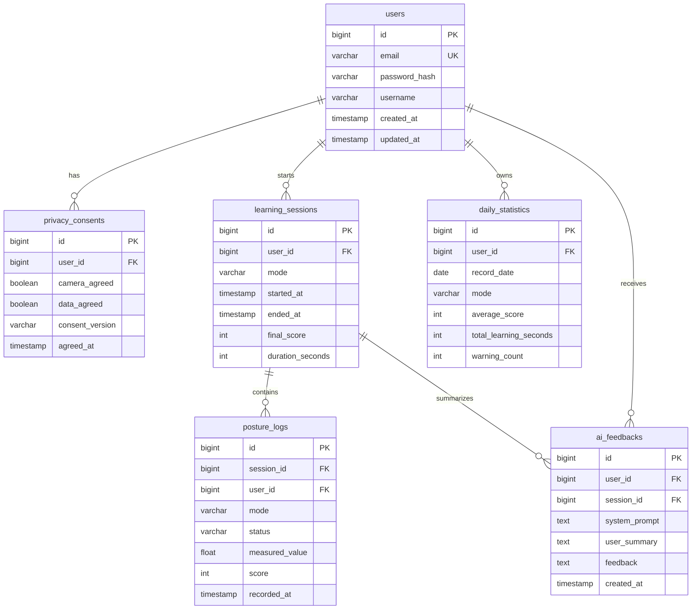
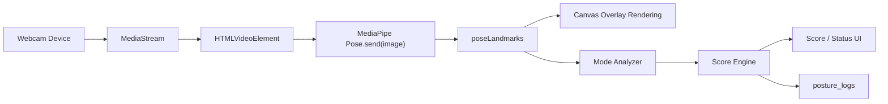
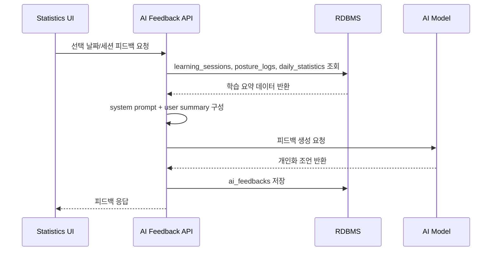
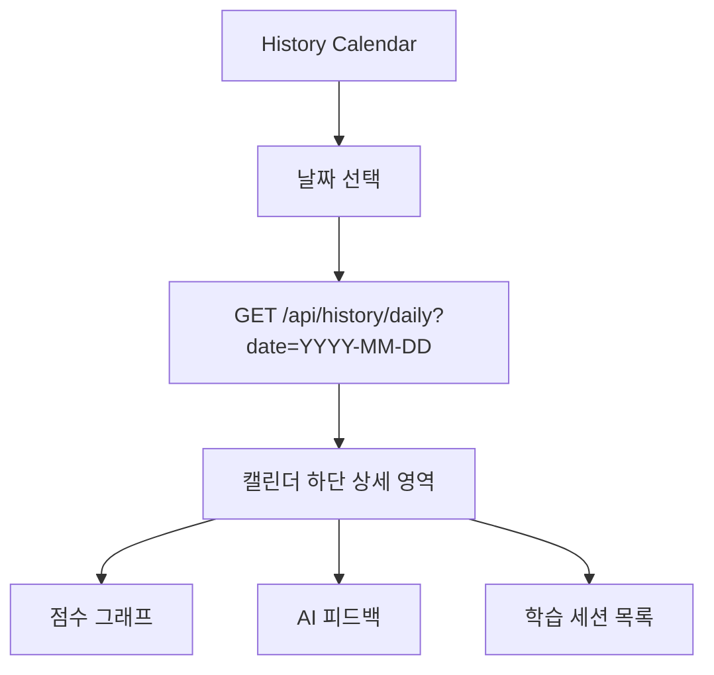

# PostureAI 소프트웨어 최종 보고서 초안

> 설치형 AI 자세 학습 앱  
> Desktop/Client: Electron Shell · Frontend: React · AI/Vision: MediaPipe Pose · Backend/DB: Node.js 기반 API 및 RDBMS 가정

---

## 초록

PostureAI는 장시간 PC 사용 환경에서 발생하기 쉬운 VDT 증후군을 예방하기 위한 설치형 AI 자세 학습 애플리케이션이다. 사용자는 설치파일을 통해 앱을 설치하고, 개인정보 및 카메라 사용 동의 후 로그인 또는 회원가입을 수행한다. 이후 대시보드에서 거북목, 키보드, 어깨, 안구 등 4가지 학습 모드를 선택하여 웹캠 기반 실시간 자세 분석을 실행할 수 있다.

본 프로젝트는 Electron 기반 데스크톱 런타임, React 기반 사용자 인터페이스, MediaPipe Pose 기반 실시간 관절 랜드마크 추출, 모드별 점수 산정 엔진, 우측 하단 Toast 알림, 학습 이력 캘린더, AI 피드백 생성 기능을 통합하는 것을 목표로 한다. 또한 users, privacy_consents, learning_sessions, posture_logs, ai_feedbacks, daily_statistics 등의 관계형 데이터베이스 테이블을 통해 사용자 계정, 개인정보 동의, 학습 세션, 자세 로그, AI 피드백, 일자별 통계를 체계적으로 저장하고 분석한다.

---

## 1. 서론 (Introduction)

### 1.1 프로젝트 배경

현대인은 학업, 업무, 여가 활동의 상당 부분을 컴퓨터와 모바일 디스플레이 앞에서 수행한다. 장시간 고정된 자세로 모니터를 바라보거나 키보드와 마우스를 반복적으로 사용하는 환경은 목, 어깨, 손목, 눈에 지속적인 부담을 준다. 이러한 신체 부담은 거북목 증후군, 손목터널증후군, 어깨 불균형, 안구건조 등으로 이어질 수 있으며, 통칭 VDT 증후군(Visual Display Terminal Syndrome)의 주요 원인이 된다.

기존 자세 교정 서비스는 사용자가 직접 기록하거나, 착용형 장비를 사용하거나, 단순 알림 타이머에 의존하는 경우가 많다. 그러나 사용자가 실제로 어떤 자세를 취하고 있는지를 실시간으로 파악하지 못하면 개인화된 피드백을 제공하기 어렵다. PostureAI는 별도 착용 장비 없이 PC 웹캠과 AI 비전 기술을 활용해 사용자의 자세를 분석하고, 학습 모드별 피드백과 통계를 제공하는 것을 목표로 한다.

### 1.2 개발 목적

PostureAI의 개발 목적은 다음과 같다.

1. 웹캠 기반 실시간 자세 분석을 통해 사용자의 잘못된 자세를 조기에 감지한다.
2. 거북목, 키보드, 어깨, 안구의 4가지 학습 모드를 제공하여 VDT 위험 요인을 세분화한다.
3. 학습 중 위험 상태가 지속될 경우 우측 하단 Toast 알림으로 즉각적인 행동 변화를 유도한다.
4. 학습 종료 후 점수 그래프, 캘린더 기반 학습 이력, AI 피드백을 제공하여 사용자가 자신의 자세 습관을 장기적으로 관리할 수 있게 한다.
5. 설치형 데스크톱 앱 구조를 통해 백그라운드 실행, 트레이 동작, OS 알림 등 실사용 환경에 가까운 사용자 경험을 제공한다.

### 1.3 기대 효과

PostureAI는 다음과 같은 효과를 기대할 수 있다.

| 기대 효과 | 설명 |
| --- | --- |
| 자세 인식 개선 | 사용자가 학습 중 자신의 자세 문제를 즉시 인지할 수 있다. |
| 예방 중심 관리 | 증상 발생 후 치료가 아니라, 잘못된 자세를 조기에 교정하는 예방형 서비스가 가능하다. |
| 개인화 피드백 | 모드별 점수, 경고 횟수, 학습 시간 데이터를 기반으로 맞춤형 AI 피드백을 제공한다. |
| 지속적 학습 | 캘린더와 그래프를 통해 일자별 학습 이력과 개선 추세를 확인할 수 있다. |
| 포트폴리오 가치 | 데스크톱 앱, AI 비전, 실시간 처리, DB 설계, 데이터 시각화, API 연동이 결합된 종합 소프트웨어 프로젝트로 확장 가능하다. |

---

## 2. 요구사항 명세 및 서비스 범위 (Scope & Requirements)

### 2.1 서비스 범위

PostureAI의 서비스 범위는 설치, 개인정보 동의, 인증, 학습 모드 설정, 웹캠 분석, 알림, 통계, AI 피드백, 설정 관리까지 포함한다.



### 2.2 기능적 요구사항

| ID | 요구사항 | 상세 설명 | 우선순위 |
| --- | --- | --- | --- |
| FR-01 | 설치파일 제공 | Windows 환경에서 실행 가능한 설치파일을 제공한다. 설치 후 실행파일 또는 바로가기를 생성한다. | High |
| FR-02 | 개인정보 및 카메라 동의 | 최초 실행 시 카메라 사용, 자세 데이터 저장, 학습 이력 저장에 대한 동의를 받는다. | High |
| FR-03 | 회원가입 | 사용자 이름, 이메일, 비밀번호를 입력받아 DB에 저장한다. 비밀번호는 해시 처리한다. | High |
| FR-04 | 로그인 | 등록된 계정으로 로그인하고 인증 세션을 생성한다. | High |
| FR-05 | 대시보드 | 4가지 학습 모드와 최근 학습 상태를 표시한다. | High |
| FR-06 | 학습 모드 설정 | 거북목, 키보드, 어깨, 안구 모드를 선택할 수 있다. | High |
| FR-07 | 웹캠 설정 | 카메라 장치 선택, 미리보기, 좌우 반전, 해상도 설정 기능을 제공한다. | High |
| FR-08 | 학습 실행/종료 | 실행 버튼으로 분석을 시작하고 종료 버튼으로 분석을 멈춘다. 종료 후에도 같은 페이지에 머무른다. | High |
| FR-09 | 캠 관절 오버레이 | MediaPipe Pose의 관절 landmark를 웹캠 화면 위에 렌더링한다. | High |
| FR-10 | 트레이 버튼 | 학습 화면 또는 앱을 트레이로 최소화하고 다시 열 수 있다. | Medium |
| FR-11 | 우측 하단 Toast 알림 | 위험 자세가 지속될 경우 Windows 알림처럼 오른쪽 하단에 알림을 표시한다. | High |
| FR-12 | 알림 빈도/세기 설정 | 사용자가 알림 주기와 강도를 설정할 수 있다. | Medium |
| FR-13 | AI 피드백 | 학습 결과를 자체 API에 전달하고 시스템 프롬프트를 결합해 개인 맞춤형 피드백을 생성한다. | High |
| FR-14 | 모드별 점수 | 4가지 학습 모드마다 별도 점수를 계산하고 표시한다. 산정 공식은 점진적으로 고도화한다. | High |
| FR-15 | 점수 그래프 | 시간대별 또는 날짜별 점수 변화 그래프를 제공한다. | High |
| FR-16 | 학습이력 캘린더 | 캘린더에 날짜별 학습 기록을 표시하고 모드별 색상으로 구분한다. | High |
| FR-17 | 선택 날짜 상세 통계 | 캘린더에서 날짜 선택 시 URL 이동 없이 캘린더 아래에 해당 날짜 통계를 비동기로 렌더링한다. | High |
| FR-18 | 테마 설정 | 다크모드와 라이트모드를 전환할 수 있다. | Medium |
| FR-19 | 비밀번호 변경 | 현재 비밀번호 검증 후 새 비밀번호로 변경한다. | Medium |
| FR-20 | 통계 삭제 | 사용자가 자신의 학습 기록과 통계를 삭제할 수 있다. 확인 모달을 제공한다. | Medium |
| FR-21 | 로그아웃 | 인증 세션을 제거하고 로그인 화면으로 이동한다. | High |

### 2.3 비기능적 요구사항

| ID | 요구사항 | 상세 설명 | 품질 속성 |
| --- | --- | --- | --- |
| NFR-01 | 실시간성 | 웹캠 프레임 분석은 사용자에게 지연이 체감되지 않는 수준으로 수행되어야 한다. | Performance |
| NFR-02 | 안정성 | 카메라 권한 거부, 모델 로딩 실패, 네트워크 오류가 발생해도 앱이 중단되지 않아야 한다. | Reliability |
| NFR-03 | 개인정보 보호 | 카메라 사용 및 자세 데이터 저장 전 명시적 동의를 받아야 하며, 비밀번호는 평문 저장을 금지한다. | Security |
| NFR-04 | 사용성 | 학습 시작, 종료, 뒤로가기, 캠 설정, 트레이 버튼은 한 화면에서 직관적으로 접근 가능해야 한다. | Usability |
| NFR-05 | 확장성 | 4가지 모드 외 신규 자세 분석 모드를 추가할 수 있도록 Score Engine을 모듈화한다. | Maintainability |
| NFR-06 | 설정 가능성 | 알림 빈도, 알림 세기, 테마 등 사용자 환경 설정은 사용자별로 저장되어야 한다. | Configurability |
| NFR-07 | 시각 일관성 | 모드별 색상 체계는 대시보드, 그래프, 캘린더, AI 피드백에서 일관되게 적용되어야 한다. | UX Consistency |
| NFR-08 | 데이터 무결성 | 학습 세션, 자세 로그, 일별 통계는 사용자와 세션 기준으로 참조 무결성을 유지해야 한다. | Data Integrity |

---

## 3. 시스템 아키텍처 (System Architecture)

### 3.1 전체 시스템 구조

PostureAI는 설치형 데스크톱 애플리케이션이므로 일반적인 웹 앱과 달리 Electron Shell이 실행 환경을 제공한다. React Renderer는 화면과 사용자 상호작용을 담당하고, AI/Vision Layer는 웹캠 프레임을 MediaPipe Pose에 전달하여 관절 랜드마크를 추출한다. Backend API는 인증, 학습 세션, 자세 로그, 통계, AI 피드백 생성을 담당한다.



### 3.2 앱 진입 및 학습 실행 시퀀스



### 3.3 학습 화면 상태 전이



---

## 4. 데이터베이스 설계 (Database Design)

### 4.1 데이터베이스 설계 원칙

PostureAI의 데이터베이스는 사용자 계정, 개인정보 동의, 학습 세션, 실시간 자세 로그, AI 피드백, 일자별 통계를 분리하여 저장한다. 실시간 로그는 대량으로 생성될 수 있으므로 posture_logs는 session_id와 recorded_at을 기준으로 인덱싱한다. 통계 화면은 매번 raw log를 전체 스캔하지 않도록 daily_statistics에 일별 요약 데이터를 저장한다.

### 4.2 ERD



### 4.3 테이블 명세

#### users

| 컬럼 | 타입 | 제약조건 | 설명 |
| --- | --- | --- | --- |
| id | BIGINT | PK, AUTO_INCREMENT | 사용자 고유 ID |
| email | VARCHAR(255) | UNIQUE, NOT NULL | 로그인 이메일 |
| password_hash | VARCHAR(255) | NOT NULL | 해시 처리된 비밀번호 |
| username | VARCHAR(50) | NOT NULL | 사용자 이름 |
| created_at | TIMESTAMP | DEFAULT CURRENT_TIMESTAMP | 가입 시각 |
| updated_at | TIMESTAMP | NULL | 정보 수정 시각 |

#### privacy_consents

| 컬럼 | 타입 | 제약조건 | 설명 |
| --- | --- | --- | --- |
| id | BIGINT | PK, AUTO_INCREMENT | 동의 기록 ID |
| user_id | BIGINT | FK(users.id) | 동의한 사용자 |
| camera_agreed | BOOLEAN | NOT NULL | 카메라 사용 동의 여부 |
| data_agreed | BOOLEAN | NOT NULL | 자세 데이터 저장 동의 여부 |
| consent_version | VARCHAR(20) | NOT NULL | 약관/동의문 버전 |
| agreed_at | TIMESTAMP | DEFAULT CURRENT_TIMESTAMP | 동의 시각 |

#### learning_sessions

| 컬럼 | 타입 | 제약조건 | 설명 |
| --- | --- | --- | --- |
| id | BIGINT | PK, AUTO_INCREMENT | 학습 세션 ID |
| user_id | BIGINT | FK(users.id), NOT NULL | 사용자 ID |
| mode | VARCHAR(30) | NOT NULL | turtle, keyboard, shoulder, eye |
| started_at | TIMESTAMP | DEFAULT CURRENT_TIMESTAMP | 학습 시작 시각 |
| ended_at | TIMESTAMP | NULL | 학습 종료 시각 |
| final_score | INT | NULL | 종료 시점 최종 점수 |
| duration_seconds | INT | DEFAULT 0 | 총 학습 시간 |

#### posture_logs

| 컬럼 | 타입 | 제약조건 | 설명 |
| --- | --- | --- | --- |
| id | BIGINT | PK, AUTO_INCREMENT | 자세 로그 ID |
| session_id | BIGINT | FK(learning_sessions.id), NOT NULL | 소속 학습 세션 |
| user_id | BIGINT | FK(users.id), NOT NULL | 사용자 ID |
| mode | VARCHAR(30) | NOT NULL | 분석 모드 |
| status | VARCHAR(20) | NOT NULL | GOOD, WARNING, DANGER |
| measured_value | FLOAT | NULL | 각도, 거리, 비율 등 측정값 |
| score | INT | NULL | 해당 시점 점수 |
| recorded_at | TIMESTAMP | DEFAULT CURRENT_TIMESTAMP | 기록 시각 |

#### ai_feedbacks

| 컬럼 | 타입 | 제약조건 | 설명 |
| --- | --- | --- | --- |
| id | BIGINT | PK, AUTO_INCREMENT | AI 피드백 ID |
| user_id | BIGINT | FK(users.id), NOT NULL | 사용자 ID |
| session_id | BIGINT | FK(learning_sessions.id), NULL | 특정 세션 기반 피드백 |
| system_prompt | TEXT | NOT NULL | 피드백 생성에 사용한 시스템 프롬프트 |
| user_summary | TEXT | NOT NULL | 학습 결과 요약 데이터 |
| feedback | TEXT | NOT NULL | AI가 생성한 피드백 본문 |
| created_at | TIMESTAMP | DEFAULT CURRENT_TIMESTAMP | 생성 시각 |

#### daily_statistics

| 컬럼 | 타입 | 제약조건 | 설명 |
| --- | --- | --- | --- |
| id | BIGINT | PK, AUTO_INCREMENT | 일별 통계 ID |
| user_id | BIGINT | FK(users.id), NOT NULL | 사용자 ID |
| record_date | DATE | NOT NULL | 통계 날짜 |
| mode | VARCHAR(30) | NOT NULL | 학습 모드 |
| average_score | INT | DEFAULT 0 | 해당 날짜 평균 점수 |
| total_learning_seconds | INT | DEFAULT 0 | 해당 날짜 총 학습 시간 |
| warning_count | INT | DEFAULT 0 | 경고 발생 횟수 |

---

## 5. 핵심 기능 및 AI 로직 구현 (Core Implementation)

### 5.1 MediaPipe 기반 실시간 관절 랜드마크 추출

PostureAI의 실시간 자세 분석은 웹캠 프레임을 MediaPipe Pose 모델에 입력하고, 모델이 반환하는 관절 landmark를 canvas 위에 오버레이로 렌더링하는 구조로 설계한다. React 컴포넌트 관점에서는 학습 화면이 video element와 canvas element를 겹쳐 배치한다.



구현상 주요 책임은 다음과 같이 분리한다.

| 모듈 | 책임 |
| --- | --- |
| useWebcam | 카메라 권한 요청, MediaStream 생성, 카메라 종료 처리 |
| useMediaPipe | MediaPipe 스크립트 로드, Pose 객체 초기화, 프레임 처리 루프 실행 |
| PoseCanvas | video 위에 관절점과 연결선을 렌더링 |
| ModeAnalyzer | 모드별 측정값 추출 및 위험 여부 판단 |
| ScoreEngine | 측정값과 지속 시간을 기반으로 점수 계산 |

### 5.2 4가지 모드별 Score Engine 개념 설계

PostureAI의 점수 산정은 초기 MVP 단계에서 간단한 휴리스틱 기반으로 시작하고, 추후 사용자별 기준값 및 통계 기반 보정으로 확장한다.

#### 5.2.1 거북목 모드

| 항목 | 내용 |
| --- | --- |
| 색상 | 초록색 |
| 분석 대상 | 귀, 어깨 landmark |
| 핵심 지표 | 목 각도, 고개 전방 이동 정도 |
| 위험 판단 | 귀가 어깨 기준선보다 과도하게 앞으로 이동하거나 목 각도가 임계값을 초과할 경우 WARNING |
| 점수 개념 | 정상 프레임 비율, 경고 지속 시간, 평균 목 각도를 조합 |

#### 5.2.2 키보드 모드

| 항목 | 내용 |
| --- | --- |
| 색상 | 파란색 |
| 분석 대상 | 손목, 팔꿈치, 어깨 landmark |
| 핵심 지표 | 손목 꺾임, 팔 위치, 키보드 사용 자세 |
| 위험 판단 | 손목 각도 또는 팔꿈치 위치가 장시간 비정상 범위에 있을 경우 WARNING |
| 점수 개념 | 손목 중립 유지 비율, 팔 위치 안정성, 경고 횟수 |

#### 5.2.3 어깨 모드

| 항목 | 내용 |
| --- | --- |
| 색상 | 노란색 |
| 분석 대상 | 좌우 어깨 landmark |
| 핵심 지표 | 좌우 어깨 높이 차이, 상체 기울기 |
| 위험 판단 | 좌우 어깨 y좌표 차이가 임계값 이상 지속될 경우 WARNING |
| 점수 개념 | 어깨 대칭 유지 시간, 기울기 평균값, 비대칭 지속 시간 |

#### 5.2.4 안구 모드

| 항목 | 내용 |
| --- | --- |
| 색상 | 빨간색 |
| 분석 대상 | 얼굴/눈 관련 landmark 또는 추가 Face Mesh 확장 |
| 핵심 지표 | 눈 깜빡임 빈도, 화면 거리 추정 |
| 위험 판단 | 깜빡임 감소 또는 화면과의 거리 과소 추정 시 WARNING |
| 점수 개념 | 적정 깜빡임 유지, 화면 거리 안정성, 경고 발생 빈도 |

### 5.3 Score Engine 의사코드

```ts
type Mode = 'turtle' | 'keyboard' | 'shoulder' | 'eye';
type Status = 'GOOD' | 'WARNING' | 'DANGER';

interface ScoreInput {
  mode: Mode;
  landmarks: PoseLandmark[];
  elapsedSeconds: number;
  previousWarnings: number;
}

interface ScoreResult {
  status: Status;
  score: number;
  measuredValue: number;
  reason: string;
}

function calculateScore(input: ScoreInput): ScoreResult {
  const metric = analyzeByMode(input.mode, input.landmarks);
  const risk = evaluateRisk(input.mode, metric);
  const penalty = risk.warningWeight + input.previousWarnings * 0.5;
  const score = clamp(100 - penalty, 0, 100);

  return {
    status: risk.status,
    score,
    measuredValue: metric.value,
    reason: risk.reason,
  };
}
```

### 5.4 AI 피드백 생성 로직

AI 피드백은 학습 세션 종료 후 또는 통계 화면에서 선택 날짜 기준으로 생성한다. 프론트엔드는 선택된 날짜 또는 세션의 요약 데이터를 Backend API로 전달하고, 서버는 사전에 정의된 시스템 프롬프트와 사용자 학습 데이터를 결합하여 자체 AI API를 호출한다.



시스템 프롬프트 예시는 다음과 같다.

```text
너는 VDT 증후군 예방을 돕는 자세 코치다.
사용자의 학습 모드, 점수, 경고 횟수, 학습 시간을 바탕으로
짧고 실천 가능한 피드백을 한국어로 제공한다.
의학적 진단처럼 단정하지 말고, 예방과 생활 습관 개선 중심으로 설명한다.
```

---

## 6. UI/UX 및 데이터 시각화 (UI/UX & Visualization)

### 6.1 UI/UX 설계 원칙

PostureAI의 UI는 학습 실행의 진입 장벽을 낮추고, 사용자가 자신의 자세 상태를 즉시 이해하도록 설계한다.

| 원칙 | 설명 |
| --- | --- |
| 즉시성 | 학습 중 상태, 점수, 알림을 실시간으로 제공한다. |
| 일관성 | 4가지 모드 색상을 앱 전반에서 동일하게 사용한다. |
| 비침습성 | 학습 종료 시 페이지 이동 없이 현재 화면에서 정지 상태를 유지한다. |
| 가시성 | 웹캠 화면 위에 관절 landmark를 표시하여 AI 분석 근거를 시각화한다. |
| 접근성 | 설정창에서 알림 빈도, 알림 세기, 테마를 조절할 수 있다. |

### 6.2 모드별 색상 전략

| 모드 | 색상 | 적용 위치 |
| --- | --- | --- |
| 거북목 | 초록색 | 대시보드 카드, 관절선, 점수 그래프, 캘린더 표시 |
| 키보드 | 파란색 | 대시보드 카드, 손목/팔 분석 그래프, 캘린더 표시 |
| 어깨 | 노란색 | 대시보드 카드, 어깨 균형 그래프, 캘린더 표시 |
| 안구 | 빨간색 | 대시보드 카드, 안구 피로 알림, 캘린더 표시 |

### 6.3 학습이력 캘린더 UX

학습이력 캘린더는 별도 페이지 이동 없이 동일 탭 내에서 날짜별 통계를 확인하도록 설계한다. 사용자가 특정 날짜를 클릭하면, 캘린더 아래 영역에서 해당 날짜의 세션 목록, 모드별 점수, 점수 그래프, AI 피드백을 비동기로 렌더링한다.



이 구조의 장점은 다음과 같다.

1. 사용자가 통계 탭과 학습이력 탭을 반복 이동하지 않아도 된다.
2. 선택 날짜 기준으로 필요한 데이터만 조회하므로 렌더링 범위를 줄일 수 있다.
3. 캘린더의 모드별 색상 표시와 하단 상세 통계가 연결되어 사용자가 학습 패턴을 직관적으로 이해할 수 있다.

### 6.4 우측 하단 Toast 알림 UX

Toast 알림은 Windows 알림창처럼 오른쪽 하단에 표시한다. 알림은 위험 자세가 일정 시간 이상 지속될 때 발생하며, 사용자의 설정값에 따라 빈도와 세기를 조절한다.

| 설정 | 예시 |
| --- | --- |
| 알림 빈도 | 즉시, 5분, 10분, 30분 |
| 알림 세기 | 약함, 보통, 강함 |
| 알림 조건 | WARNING 상태 10초 이상 지속, DANGER 즉시 표시 |
| 알림 내용 | 모드명, 위험 사유, 간단한 교정 행동 |

---

## 7. 개발 로드맵 및 단계별 구현 (Development Roadmap)

### 7.1 WBS

| Phase | 작업명 | 주요 산출물 | 상태 |
| --- | --- | --- | --- |
| Phase 0 | 프로토타입 | Electron 실행, React 화면, MediaPipe 웹캠 분석, 거북목 점수 프로토타입 | 진행/완료 |
| Phase 1 | 앱 진입 완성 | 설치 흐름, 개인정보 동의, 회원가입/로그인 DB 연동 | 계획 |
| Phase 2 | 학습 화면 완성 | 캠 설정, 실행/종료, 뒤로가기, 트레이 버튼, 관절 오버레이 | 계획 |
| Phase 3 | 피드백/통계 | Toast 알림, AI 피드백, 점수 그래프, 학습이력 캘린더 | 계획 |
| Phase 4 | 설정/데이터 관리 | 알림 빈도/세기, 테마, 비밀번호 변경, 통계 삭제, 로그아웃 | 계획 |

### 7.2 단계별 개발 회고

#### Phase 0. 프로토타입

초기 단계에서는 React 기반 화면 구성과 Electron 실행 환경을 먼저 구현한다. 이후 MediaPipe Pose를 적용하여 웹캠 화면에서 관절 landmark를 추출하고, 거북목 모드의 목 각도 계산을 통해 GOOD/WARNING 상태를 표시한다. 이 단계의 핵심은 기술 가능성을 검증하는 것이다.

#### Phase 1. 앱 진입 완성

설치파일과 최초 실행 흐름을 정리한다. 개인정보 및 카메라 동의 화면을 추가하고, 회원가입/로그인 데이터를 DB에 저장한다. 이 단계부터 사용자별 학습 기록을 누적할 수 있는 기반이 마련된다.

#### Phase 2. 학습 화면 완성

대시보드에서 학습 모드를 선택하면 학습 화면으로 이동한다. 학습 화면은 캠 설정, 실행/종료, 뒤로가기, 관절 표시, 트레이 버튼을 포함한다. 종료 버튼을 누르면 학습은 멈추지만 페이지는 유지되어 사용자가 마지막 점수와 상태를 확인할 수 있다.

#### Phase 3. 피드백/통계

학습 로그를 기반으로 점수 그래프와 통계를 제공한다. 캘린더에서 날짜를 선택하면 해당 날짜의 통계가 아래에 비동기 렌더링된다. 또한 학습 결과를 자체 AI API에 전달하여 시스템 프롬프트 기반 개인화 피드백을 생성한다.

#### Phase 4. 설정/데이터 관리

사용자가 알림 빈도, 알림 세기, 테마를 설정하고, 비밀번호 변경, 통계 삭제, 로그아웃을 수행할 수 있도록 한다. 통계 삭제와 같은 위험 작업은 확인 모달을 제공하여 오작동을 방지한다.

---

## 8. 결론 및 향후 과제 (Conclusion & Future Work)

### 8.1 결론

PostureAI는 설치형 데스크톱 앱, 실시간 AI 비전 분석, 모드별 자세 점수, Toast 알림, 통계 시각화, 캘린더 기반 학습 이력, AI 피드백을 통합한 종합 소프트웨어 프로젝트이다. 단순한 웹 페이지 수준을 넘어 Electron 기반 실행 환경과 MediaPipe 기반 실시간 처리, RDBMS 기반 학습 데이터 저장, 자체 API 기반 피드백 생성을 결합함으로써 컴퓨터공학 졸업작품과 실무 포트폴리오 양쪽에서 의미 있는 기술적 완성도를 갖출 수 있다.

특히 4가지 학습 모드를 통해 VDT 증후군의 주요 위험 요인을 세분화하고, 모드별 색상 체계와 캘린더 UX를 적용하여 사용자가 자신의 학습 이력을 직관적으로 이해할 수 있도록 설계했다. 또한 학습 종료 후 같은 페이지에서 결과를 확인하는 UX와 우측 하단 알림은 실제 데스크톱 사용 환경에 적합한 상호작용 방식이다.

### 8.2 향후 과제

| 과제 | 설명 |
| --- | --- |
| 점수 알고리즘 고도화 | 초기 휴리스틱 기반 점수를 사용자별 기준값과 장기 학습 데이터를 반영하는 방식으로 개선한다. |
| Face Mesh 확장 | 안구 모드의 정확도를 높이기 위해 MediaPipe Face Mesh 또는 별도 눈 깜빡임 분석 모델을 적용한다. |
| 백그라운드 학습 안정화 | 트레이 상태에서도 학습 세션과 알림이 안정적으로 유지되도록 Electron main process와 renderer 간 상태 동기화를 강화한다. |
| 개인정보 보호 강화 | 로컬 저장 데이터 암호화, 민감 데이터 삭제 정책, 동의 철회 기능을 추가한다. |
| AI 피드백 품질 개선 | 시스템 프롬프트 버전 관리, 피드백 템플릿, 사용자별 금칙 표현 정책을 설계한다. |
| 리포트 기능 | 주간/월간 PDF 리포트 또는 이미지 리포트로 학습 개선 추세를 제공한다. |
| 비즈니스 확장 | 학교, 기업, 공공기관의 VDT 예방 교육용 솔루션으로 확장할 수 있다. |

### 8.3 최종 요약

PostureAI는 사용자의 자세를 실시간으로 관찰하고, 위험 상태를 즉시 알려주며, 학습 이력과 AI 피드백을 통해 장기적인 행동 변화를 유도하는 예방 중심 소프트웨어이다. 본 프로젝트는 데스크톱 앱 개발, 프론트엔드 UI/UX, 실시간 AI 비전 처리, 데이터베이스 설계, API 연동, 데이터 시각화, 개인화 피드백이라는 다양한 컴퓨터공학 역량을 통합적으로 보여주는 졸업작품으로 평가될 수 있다.
