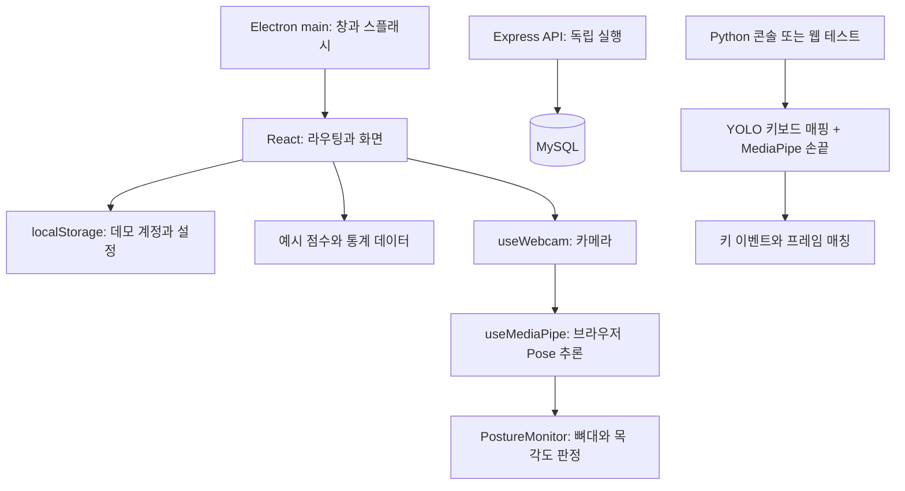

# 현재 구조와 코드 탐색 가이드

기준: 2026-09-05 / `12c213f`. 이 문서의 흐름은 현재 소스 기준이며, 향후 구조는 [roadmap.md](roadmap.md)에 분리했습니다.

## 1. 실제 연결 상태



React에서 Express로 향하는 API 호출과 Electron에서 Python을 실행·연결하는 코드는 현재 없습니다. `PostureMonitor`의 판정 결과를 상위 화면 점수로 전달하는 계약도 없습니다. 서버와 Python을 함께 실행해도 자동 연결되지 않습니다.

## 2. 기술의 역할

| 기술 | 이 프로젝트에서 하는 일 | 시작 파일 |
| --- | --- | --- |
| React + TypeScript | 화면·상태·컴포넌트 | [App.tsx](../front/src/App.tsx) |
| React Router / HashRouter | `#/login`, `#/learn/turtle` 등의 화면 전환 | [App.tsx](../front/src/App.tsx) |
| Tailwind CSS | JSX 클래스 중심 스타일 | [index.css](../front/src/index.css), [vite.config.ts](../front/vite.config.ts) |
| Recharts / Lucide | 차트 / 아이콘 | [Statistics.tsx](../front/src/pages/Statistics.tsx), [modes.tsx](../front/src/data/modes.tsx) |
| Vite + Electron 플러그인 | 화면 개발 서버와 Electron 코드 빌드 | [vite.config.ts](../front/vite.config.ts) |
| Electron / electron-builder | 데스크톱 창 / 설치 패키징 | [main.ts](../front/electron/main.ts), [package.json](../front/package.json) |
| MediaPipe Pose (JS) | 웹캠에서 신체 랜드마크 추론 | [useMediaPipe.ts](../front/src/hooks/useMediaPipe.ts) |
| Express + mysql2 | HTTP 요청 처리와 SQL 실행 | [app.ts](../server/src/app.ts), [db.ts](../server/src/db.ts) |
| bcrypt + JWT | 서버 비밀번호 해시와 인증 토큰 | [auth.ts](../server/src/auth.ts) |
| Ultralytics YOLO + OpenCV + NumPy | 키보드 네 코너 검출, 좌표 변환 | [keyboard_mapper.py](../keyboard-detect/src/keyboard_mapper.py), [auto_map.py](../keyboard-detect/src/auto_map.py) |
| MediaPipe Hands (Python) + pynput | 손끝 검출 / 전역 키 입력 수신 | [finger_tracker.py](../keyboard-detect/keylog/finger_tracker.py), [key_capture.py](../keyboard-detect/keylog/key_capture.py) |
| Flask + Socket.IO | Python 모듈의 선택형 웹 테스트 도구 | [service.py](../keyboard-detect/keylog/service.py) |

JS MediaPipe와 Python MediaPipe는 서로 다른 실행 환경입니다. 이름이 같아도 버전 하나로 합치는 대상이 아닙니다. 실제 잠금 버전은 [dependencies.md](dependencies.md)를 참고합니다.

## 3. 프론트와 Electron

```text
front/
  electron/main.ts       창 생성, 스플래시, 개발 URL/빌드 파일 로드
  electron/preload.ts    렌더러에 ipcRenderer 래퍼 노출
  src/main.tsx          React 시작
  src/App.tsx           라우트, 공통 화면 틀, 테마 적용
  src/pages/            로그인, 대시보드, 측정, 통계, 이력, 설정
  src/components/       버튼, 대화상자, 사이드바, 모드 선택, 자세 모니터
  src/hooks/            웹캠과 MediaPipe의 생명주기
  src/utils/            로컬 인증 저장소, 각도 계산
  src/data/             모드 정의와 예시 이력
  public/               아이콘과 스플래시 HTML
```

`dist`, `dist-electron`, `release`, `node_modules`, 캐시 폴더는 생성물입니다. 수정은 대응하는 소스와 설정에서 합니다.

### 기능별 구현 범위

| 기능 | 현재 동작/제약 | 읽거나 수정할 시작 지점 |
| --- | --- | --- |
| 로그인·가입·계정 변경 | `localStorage`에 평문 비밀번호를 포함한 데모 사용자 저장. 서버 JWT와 무관 | [authStore.ts](../front/src/utils/authStore.ts), [Login.tsx](../front/src/pages/Login.tsx), [Register.tsx](../front/src/pages/Register.tsx) |
| 접근 제어 | `App.tsx`에 인증을 검사하는 보호 라우트 없음 | [App.tsx](../front/src/App.tsx) |
| 측정 시작·중지·시간 | 화면 상태와 1초 타이머. 재시작 시 시간·점수 초기화 | [LearningSession.tsx](../front/src/pages/LearningSession.tsx) |
| 화면 점수 | 100에서 난수로 감소, 최저 58. 카메라 결과와 무관하며 상태 표시는 80점 기준 | 같은 파일의 `useEffect`, `isGoodPosture` |
| 자세 인식 | Pose 랜드마크와 목 각도 판정. `turtle`에만 실제 판정 분기 존재 | [PostureMonitor.tsx](../front/src/components/PostureMonitor.tsx) |
| 어깨·키보드·안구 모드 | 선택 UI 있음. 어깨 대칭 계산 함수는 있으나 모니터에서 사용하지 않음. 키보드/안구 전용 측정 연결 없음 | [modes.tsx](../front/src/data/modes.tsx), [postureCalculator.ts](../front/src/utils/postureCalculator.ts) |
| 첫 자세 캘리브레이션 | 기준 자세 수집·유효성 검사·저장·재설정 흐름을 현재 소스에서 찾지 못함 | 구현 전 팀 확인 필요 |
| 카메라 선택 | 셀렉트는 고정 옵션이며 `deviceId` 연결 없음. 웹캠은 1280×720을 우선 요청 | [LearningSession.tsx](../front/src/pages/LearningSession.tsx), [useWebcam.ts](../front/src/hooks/useWebcam.ts) |
| 통계·이력 | 고정된 예시 배열 사용 | [Statistics.tsx](../front/src/pages/Statistics.tsx), [mockLearningHistory.ts](../front/src/data/mockLearningHistory.ts), [LearningHistory.tsx](../front/src/pages/LearningHistory.tsx) |
| 설정 | 테마는 적용. 알림 빈도·강도·점수 기준·민감도는 로컬 저장되지만 측정 엔진에서 읽지 않음 | [Settings.tsx](../front/src/pages/Settings.tsx) |
| 트레이·휴식 알림 | 트레이 버튼은 안내 대화상자. 실제 Tray/OS 알림/휴식 판단 엔진 없음 | [LearningSession.tsx](../front/src/pages/LearningSession.tsx), [main.ts](../front/electron/main.ts) |
| AI 요약 | 생성 요청·서버 경로 없음. 화면 피드백은 예시 텍스트 | 통합 계약부터 설계 |

### 핵심 코드 해설과 변경 시 주의점

- `useWebcam`은 브라우저의 카메라 스트림을 열고 트랙을 종료합니다. `PostureMonitor`는 `isRunning` 검사 전에 카메라를 여므로 분석 중지 상태에도 미리보기용 카메라가 열릴 수 있습니다. 분석 중지와 카메라 해제의 UX를 먼저 정해야 합니다.
- `useMediaPipe`는 `<script>`로 CDN 파일을 받아 `window.Pose`를 만들고, 프레임을 `requestAnimationFrame` 루프로 보냅니다. `pose.send()`와 초기화가 비동기이므로 빠른 시작/중지·화면 이탈에서 늦게 완료되는 작업을 검증해야 합니다.
- `calculateNeckAngle`은 정규화된 2차원 귀·어깨 좌표로 수직선 대비 각도를 계산합니다. 현재 임계값 15도는 코드 상수입니다. 촬영 방향·화면 비율·개인 기준 보정의 영향을 검증하지 않고 제품 점수 기준으로 확정하면 안 됩니다.
- 목 판정에서 양쪽 귀 visibility가 낮으면 `avgAngle`이 0에 머물러 정상으로 분류될 수 있습니다. 프레임 카운트가 있지만 0.5초마다 상태를 갱신할 때 사용하는 값은 그 순간의 `isTurtleNeck`입니다. “최근 0.5초 다수결”이라는 기존 주석은 구현과 다릅니다.
- `preload.ts`의 IPC 래퍼는 템플릿 수준입니다. Python 연동·알림·트레이를 위한 명령/응답 계약과 main 측 처리기는 없습니다. 기능별 허용 채널과 정리 책임을 정의한 뒤 확장합니다.

위 내용은 현재 로직에 대한 설명입니다. 점수 공식과 캘리브레이션을 변경할 때 입력 좌표 단위, 누락값 처리, 임계값 근거, 비동기 정리 책임을 해당 코드 가까이에 주석으로 남기는 것을 제안합니다. 이번 단계에서는 기능 코드나 기존 주석을 변경하지 않았습니다.

## 4. 서버와 데이터베이스

실행 흐름은 `src/server.ts → src/app.ts → routes/* → db.ts → MySQL`입니다. 라우트가 입력 처리, SQL, 통계 계산까지 직접 담당합니다. 별도의 서비스 계층·마이그레이션 체계·자동 테스트는 현재 없습니다.

### 현재 API 계약

기본 포트는 4000입니다. 아래 경로는 구현된 API이며 프론트가 호출하고 있다는 뜻은 아닙니다. 인증이 필요한 요청은 `Authorization: Bearer <token>`을 사용합니다.

| 메서드와 경로 | 인증 | 요청 / 응답의 핵심 |
| --- | --- | --- |
| `GET /health` | 없음 | `{status: "ok"}`. DB 연결 검사가 아님 |
| `POST /api/auth/register` | 없음 | `username, nickname, password, email?` / 메시지 |
| `POST /api/auth/login` | 없음 | `username, password` / `token, user{id, username, nickname}` |
| `GET /api/auth/check/:username` | 없음 | `{exists}`. 본인 확인이나 계정 복구 API가 아님 |
| `GET /api/auth/me` | 필요 | `id, username, nickname, email` |
| `PUT /api/auth/me` | 필요 | `nickname` / 메시지 |
| `PUT /api/auth/me/password` | 필요 | `currentPassword, newPassword` / 메시지 |
| `POST /api/sessions` | 필요 | `mode` / `id, mode, startedAt` |
| `PATCH /api/sessions/:id/end` | 필요 | `score, alertCount` / 종료 및 일일 통계 집계 |
| `POST /api/sessions/:id/logs` | 필요 | `status, measuredValue?` / 메시지 |
| `GET /api/sessions?date=YYYY-MM-DD` | 필요 | 세션 배열. 날짜 생략 시 최근 50개 |
| `GET /api/sessions/:id` | 필요 | 세션 컬럼과 `graph: [{time, score}]` |
| `GET /api/statistics/today` | 필요 | `averageScore, sessionCount, totalSeconds, byMode` |
| `GET /api/statistics/trend?date=YYYY-MM-DD` | 필요 | 시간대별 `{time, score}` 배열 |
| `GET /api/statistics/calendar?year=YYYY&month=M` | 필요 | `{date, session_count, avg_score}` 배열 |
| `GET /api/statistics/improvement` | 필요 | `todayAvg, yesterdayAvg, improvement` |

현재 응답에는 camelCase와 DB의 snake_case가 섞입니다. 프론트 데모의 문자열 사용자 ID와 서버의 숫자 `users.id`도 다릅니다. 프론트 연결 전에 요청/응답 타입, 실패 응답, 날짜 표현을 합의해야 합니다.

### 스키마의 기준과 충돌

[server/schema.sql](../server/schema.sql)이 현재 서버의 쿼리와 대응하는 정의입니다. 하지만 마이그레이션이 아니라 기존 테이블을 `DROP TABLE` 후 재생성하는 스크립트입니다. 헤더는 `Graduation_Project`, 환경 예시는 `moti` DB를 가리킵니다. 실제 팀 DB 이름과 보존 여부는 미확인입니다.

| 테이블 | 현재 저장 대상 |
| --- | --- |
| `users` | 아이디, 닉네임, 이메일, 비밀번호 해시, settings JSON |
| `sessions` | 모드, 시작/종료, 점수, 경고 횟수 |
| `posture_logs` | 상태, 의미/단위가 고정되지 않은 `measured_value`, 기록 시각 |
| `daily_statistics` | 날짜·모드별 시간, 평균 점수, 세션 수 |
| `feedback` | 피드백 텍스트. 이를 생성·조회하는 API는 없음 |

[front/database_schema.sql](../front/database_schema.sql)은 `password_hash`, `nickname`, 세션 점수 등이 없고 통계에 `average_value`를 사용합니다. 현재 서버용 대체 스키마로 사용할 수 없습니다.

### 통합 전에 해결할 구체적인 문제

1. `sessions.ts`의 종료 요청을 반복하면 일일 통계가 매번 가산됩니다. 세션 종료·집계가 트랜잭션으로 묶여 있지 않습니다. 재전송해도 한 번만 반영되는 종료 처리부터 검증해야 합니다.
2. 로그 기록 라우트는 JWT만 검사하고 해당 세션의 소유자·종료 여부를 검사하지 않습니다. 다른 계정의 세션 ID에 기록을 넣지 못하도록 검증이 필요합니다.
3. 로그와 점수의 범위, 모드 값, ID, 날짜에 대한 런타임 검증이 부족합니다. TypeScript 타입 단언은 HTTP 입력을 검증하지 않습니다.
4. 상세/추세 그래프는 `AVG(measured_value)`를 `score`로 반환합니다. 각도와 점수는 다른 양이므로 점수 개편과 함께 계약을 분리해야 합니다. `bad_posture_seconds`를 갱신하는 경로도 없습니다.
5. DB의 현재 날짜, JS UTC 날짜, 연결 설정 `+09:00`이 혼재합니다. 집계 SQL의 그룹화·정렬과 날짜 변환은 실제 MySQL 버전·SQL mode·시간대에서 검증해야 합니다.
6. 라우트의 비동기 DB 오류를 공통 오류 처리로 넘기는 명시적 경로가 없습니다. DB 연결 실패/쿼리 실패 시 실제 응답을 검사해야 합니다.

이 항목들은 소스에서 확인한 개선 지점이며, 실제 DB에 재현 요청을 실행한 결과는 아닙니다.

## 5. Python 키보드 분석

현재 목적은 **누른 키와 그 시점에 보이는 손가락의 매칭**입니다. 손목 각도·자세 점수·휴식 판단은 별도로 정의해야 합니다.

1. `src/auto_map.py`: YOLO가 네 코너 키를 찾습니다. Homography(원근 변환)로 기준 키보드 좌표를 카메라 이미지에 맞춥니다.
2. `src/keyboard_mapper.py`: 검출·좌표 품질을 확인하고 `KeyboardMappingResult`를 만듭니다.
3. `src/identify_key.py`: 한 점이 어느 키 영역 안에 있는지 판단합니다.
4. `keylog/finger_tracker.py`: Hands 랜드마크를 이미지 픽셀 단위 손끝 좌표로 바꿉니다.
5. `keylog/key_capture.py`와 `events.py`: 키 이벤트·프레임·분석 결과 데이터 구조를 제공합니다.
6. `keylog/frame_buffer.py`: 키 시각과 가장 가까운 프레임을 고릅니다. 브라우저 이벤트는 같은 브라우저 시계, 전역 이벤트는 Python 시계와 수신 지연 보정을 사용합니다. 서로 다른 시계의 숫자를 그대로 비교하면 안 됩니다.
7. `keylog/analyzer.py`: 키 영역과 손끝을 합쳐 `PressAnalysis`를 만듭니다. 핵심 결과는 `pressed_key`, `pressed_finger`, `finger_keys`, `keyboard_ok`, 지연 정보입니다. `FingerPoint.score`는 자세 점수가 아닙니다.

`models/best.pt`와 `data/perfect_map.json`이 필요합니다. `analyzer.py`가 상대 위치로 파일을 찾고 `src`를 `sys.path`에 추가하므로 폴더만 옮기면 import와 모델 경로가 깨질 수 있습니다. 기준 맵은 61키이며 다른 키보드 배열 지원 범위는 팀 확인이 필요합니다.

키보드 맵 고정(`freeze_mapping`)은 카메라/키보드 위치의 재사용 기능입니다. 사용자의 첫 자세를 측정하는 캘리브레이션과 구분해야 합니다.

`keylog/service.py`의 5055 포트는 테스트 서버입니다. Flask를 Moti의 계정·통계 서버로 채택했다는 의미는 아닙니다. 자세용 상체 화면과 키보드용 손/키보드 화면을 한 카메라로 동시에 얻을지는 먼저 실물 구도로 확인해야 합니다.
