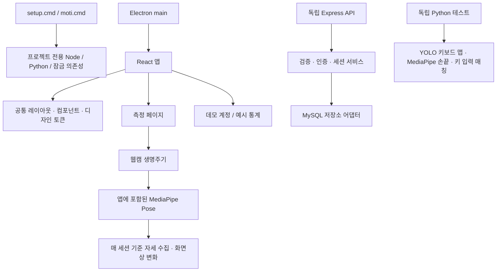

# 현재 구조와 코드 시작점

초기 소스 감사 이후 사용자 결정에 따라 구조를 정리한 현재 안내입니다. 초기 상태는 [최초 감사 기록](architecture-initial-audit.md)에 남겼습니다. 제품 방향과 미정 사항은 [product-decisions.md](product-decisions.md)를 먼저 확인합니다.

## 실행 경계

React와 API, Electron과 Python을 잇는 제품용 연결은 아직 없습니다. 동시에 프로세스를 실행하는 것만으로 연결되지 않습니다. MySQL은 현재 코드와 호환되는 어댑터이며 최종 DB 제품을 승인받았다는 의미가 아닙니다.

## 파일별 책임

| 경로 | 책임 / 다음 변경 시작점 |
| --- | --- |
| `toolchain.json`, `scripts/setup.ps1`, `scripts/toolchain.ps1` | 정확한 도구 버전, 검증된 다운로드, 프로젝트 전용 환경 설치 |
| `scripts/moti.ps1` | 앱/API/Python 실행과 검사 명령 묶음 |
| `front/electron/main.ts` | 창·스플래시 생성, 개발 URL/설치 파일 로드 |
| `front/electron/preload.ts` | Electron IPC 경계. 제품별 허용 명령 정의는 후속 작업 |
| `front/vite.config.ts` | UI와 Electron 빌드, CommonJS preload 출력, 브라우저 검증 모드 |
| `front/src/App.tsx` | 라우트 정의. 인증 보호 라우트는 아직 없음 |
| `front/src/components/layout/AppLayout.tsx` | 사이드바와 공통 화면 틀/Outlet |
| `front/src/styles/tokens.css` | 공통 색상, 의미별 CSS 변수, 다크 테마 |
| `front/src/components/Button.tsx`, `Sidebar.tsx`, `ModeSelector.tsx` | 공유 UI. 새 화면은 공통 토큰/컴포넌트부터 사용 |
| `front/src/components/AppDialog.tsx` | 대화상자 Provider와 표시 |
| `front/src/components/dialog/dialogContext.ts`, `useDialog.ts` | 대화상자 타입/상태 계약과 호출 훅 |
| `front/src/pages/LearningSession.tsx` | 모드별 화면, 실제 장치 선택, 시작/중지/기준 재수집, 관측 상태 표시 |
| `front/src/components/PostureMonitor.tsx` | 웹캠·모델·기준 수집 연결, 오버레이, 누락/오류 상태 전달 |
| `front/src/hooks/useWebcam.ts` | 장치 요청과 트랙 해제. 늦게 완료된 이전 요청도 폐기 |
| `front/src/hooks/useMediaPipe.ts` | 로컬 Pose 파일 로드, 프레임 처리, 비동기 초기화/종료 제어 |
| `front/src/features/posture/calibration.ts` | DOM 없는 기준 자세 수집/관측 계산. 단위·품질·샘플 정책 |
| `front/src/utils/authStore.ts` | 아직 사용하는 로컬 데모 인증. 서버 연결 때 교체할 경계 |
| `front/src/data/mockLearningHistory.ts`, `pages/Statistics.tsx` | 아직 예시 데이터. 실 API 연동 대상으로 구분 |
| `server/src/server.ts`, `config.ts` | 환경 검증 후 서버 시작. JWT 비밀값 자동 기본값 없음 |
| `server/src/app.ts`, `http.ts` | API 조립과 공통 비동기 오류 응답 |
| `server/src/validation.ts` | HTTP 입력을 런타임에서 검사 |
| `server/src/routes/` | HTTP 계약/인증/응답 변환 |
| `server/src/services/sessions.ts` | 세션 소유권, 종료 정책, 트랜잭션 작업 경계 |
| `server/src/repositories/sessions.ts` | MySQL SQL, 행 잠금, 트랜잭션, 통계 집계 |
| `server/test/` | 입력·인증·HTTP 오류·세션 재시도/소유권 회귀 검사 |
| `keyboard-detect/pyproject.toml`, `uv.lock` | Python 의존성의 입력 선언과 정확한 해결 결과 |
| `keyboard-detect/src/` | 키보드 검출·원근 변환·키 영역 판정 |
| `keyboard-detect/keylog/` | 키 이벤트·프레임·손끝 연결. 기존 공개 데이터 구조 유지 |
| `keyboard-detect/scripts/check_environment.py` | 카메라/키 수집 없이 Python import·모델·맵 확인 |

## 측정 화면의 계약

`LearningSession → PostureMonitor → useWebcam/useMediaPipe → calibration` 순서입니다. 모드 변경과 기준 다시 잡기는 이전 스트림·모델 세션을 정리하고 새 기준을 수집합니다. 중지하면 카메라도 해제합니다. 기준 수집은 현재 `turtle`, `shoulder`에 연결되어 있습니다. 키보드·안구는 전용 분석 연결 전까지 해당 화면의 시작을 비활성화했습니다.

`MonitorSnapshot`은 준비/수집/관찰/관찰 불가/오류 상태와 수집 진행률, 유효 관찰 시간, 기준 대비 변화량을 전달합니다. 사용자의 자세가 의학적으로 올바른지 판단하는 타입이 아닙니다.

- 2D 좌표는 이미지 가로/세로 픽셀로 환산한 뒤 어깨 너비 대비 비율을 계산합니다.
- 약 3초의 연속 안정 관측으로 중앙값 기준을 수집합니다. 이는 잠정 수집 설정이며 점수/건강 임계값이 아닙니다.
- 얼굴·어깨가 안 보이거나 신뢰도가 낮으면 수집을 다시 시작합니다.
- 기준 확보 후 관측이 사라지면 값과 유효 관찰 시간의 증가를 중단합니다. 이를 휴식이나 정상으로 바꾸지 않습니다.
- 화면의 “기준 대비 변화”는 세 지표 변화량의 절댓값 중 최대값을 어깨 너비 대비 %로 표현한 것입니다. 최종 자세 점수는 아직 없습니다.
- 카메라 위치를 물리적으로 옮기면 다시 수집해야 합니다. 장치 ID/해상도 변경은 자동 감지하지만 모든 물리적 이동을 자동 판별하지는 못합니다.

구체적 타입과 검증 한계는 [calibration.md](calibration.md)에 있습니다.

## 서버의 유지 계약과 변경

기존 `/api/auth`, `/api/sessions`, `/api/statistics`, `/health` 경로를 유지합니다. 상세 경로는 최초 감사 기록의 API 표와 현재 routes 파일을 함께 확인합니다.

- 세션 종료는 동일 DB 트랜잭션에서 행 잠금 후 한 번만 집계합니다. 이미 끝난 세션의 재요청은 통계를 더하지 않습니다.
- 종료 입력 `score`(0–100 정수), `alertCount`(0 이상 정수)는 필수입니다. 누락한 점수를 100점으로 저장하던 동작을 제거했습니다. 이 점수 필드는 기존 API 호환 계약이며 새 자세 점수 산식이 아닙니다.
- 로그 기록에서도 세션 소유자와 종료 여부를 검사합니다. 잘못된 입력은 400, 타인의 세션은 404, 종료 후 기록은 409로 처리합니다.
- 비동기 DB 오류를 공통 오류 응답으로 전달합니다. `/health`는 DB 준비 여부를 검사하지 않습니다.
- MySQL 트랜잭션/행 잠금은 실제 배포 DB의 엔진·시간대·SQL mode에서 추가 검증해야 합니다. 이번 단위 테스트의 대역 저장소가 실제 DB를 대체해 검증해 주는 것은 아닙니다.

통계 그래프에 남아 있는 `AVG(measured_value) AS score`는 기존 계약입니다. 이를 새 자세 점수로 쓰면 안 됩니다. 현재 DB 구조에는 새 기준 자세/손가락 오사용/휴식/점수 버전을 모두 저장할 계약이 없으므로 DB 선정 후 마이그레이션을 설계합니다.

## 재사용과 교체 범위

React/Electron, UI 자산, Python 키보드 맵/손끝 분석은 재사용했습니다. 비동기 카메라 연결, 기준 자세 수집, 세션 종료·검증 경계는 새로 구성했습니다. 전체 재작성보다 비용이 낮다는 설계 판단이며 성능 향상을 측정한 결과는 아닙니다.

`front/src/utils/postureCalculator.ts`의 기존 각도 계산 유틸은 현재 새 모니터에서 사용하지 않습니다. 이전 코드를 임의 삭제하지 않고 남겼으며, 정면 캘리브레이션과 혼용하지 않습니다. 기존 Dockerfile과 두 SQL은 이전 구현 자료로 남아 있으므로 현재 개발 진입점 대신 실행하지 않습니다.
