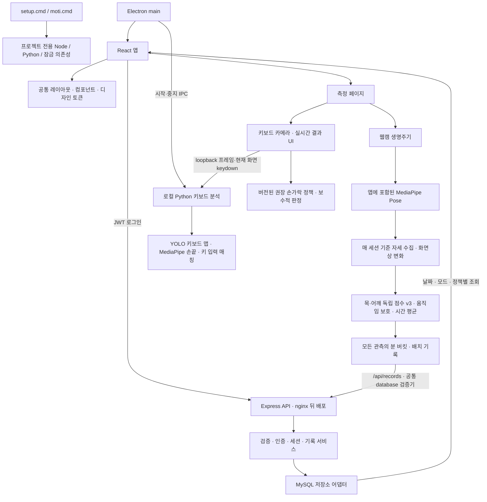

# 현재 구조와 코드 시작점

초기 소스 감사 이후 사용자 결정에 따라 구조를 정리한 현재 안내입니다. 초기 상태는 [최초 감사 기록](architecture-initial-audit.md)에 남겼습니다. 제품 방향과 미정 사항은 [product-decisions.md](product-decisions.md)를 먼저 확인합니다.

## 실행 경계

```mermaid
flowchart TD
  S[setup.cmd / moti.cmd] --> T[프로젝트 전용 Node / Python / 잠금 의존성]
  E[Electron main] --> R[React 앱]
  E -->|시작·중지 IPC| K[로컬 Python 키보드 분석]
  R --> UI[공통 레이아웃 · 컴포넌트 · 디자인 토큰]
  R --> M[측정 페이지]
  M --> W[웹캠 생명주기]
  W --> P[앱에 포함된 MediaPipe Pose]
  P --> C[매 세션 기준 자세 수집 · 화면상 변화]
  C --> V1[목·어깨 독립 점수 v3 · 움직임 보호 · 시간 평균]
  R -->|JWT 로그인| A[Express API · nginx 뒤 배포]
  V1 --> REC[모든 관측의 분 버킷 · 배치 기록]
  REC -->|/api/records · 공통 database 검증기| A
  A --> V[검증 · 인증 · 세션 · 기록 서비스]
  V --> DB[MySQL 저장소 어댑터]
  DB -->|날짜 · 모드 · 정책별 조회| R
  M --> KM[키보드 카메라 · 실시간 결과 UI]
  KM -->|loopback 프레임·현재 화면 keydown| K
  K --> F[YOLO 키보드 맵 · MediaPipe 손끝 · 키 입력 매칭]
  KM --> FP[버전된 권장 손가락 정책 · 보수적 판정]
```

Electron 개발 앱의 키보드 모드는 로컬 Python 프로세스를 자동 실행하고 현재 화면의 카메라 프레임·키 입력을 연결합니다. 로그인과 목·어깨·키보드·안구 기록은 서버 API(`/api/auth`, `/api/records`)를 사용합니다. 기존 `/api/sessions` 측정 경로는 여전히 프론트가 호출하지 않습니다. 서버 주소는 `front/.env`의 `VITE_MOTI_API_URL`이며 저장 계약은 [database](../database/README.md)를 따릅니다.

## 파일별 책임

| 경로 | 책임 / 다음 변경 시작점 |
| --- | --- |
| `toolchain.json`, `scripts/setup.ps1`, `scripts/toolchain.ps1` | 정확한 도구 버전, 검증된 다운로드, 프로젝트 전용 환경 설치 |
| `scripts/moti.ps1` | 앱/API/Python 실행과 검사 명령 묶음 |
| `front/electron/main.ts` | 창·스플래시, Python 키보드 프로세스, 신뢰 창 IPC·종료 전 기록 flush 요청 |
| `front/electron/preload.ts` | 키보드 시작·중지, motiRecords 종료 flush 및 주 창 전용 테마 IPC 경계 |
| `front/vite.config.ts` | UI와 Electron 빌드, CommonJS preload 출력, 브라우저 검증 모드 |
| `front/src/App.tsx` | 라우트 정의와 네이티브 제목 표시줄 테마 동기화. 인증 보호 라우트는 아직 없음 |
| `front/src/components/layout/WindowTitleBar.tsx`, `front/electron/windowAppearance.ts` | 테마 제목 표시줄과 Windows 기본 창 버튼 overlay. 브라우저에는 자체 표시줄을 추가하지 않음 |
| `front/src/components/layout/AppLayout.tsx` | 사이드바와 공통 화면 틀/Outlet |
| `front/src/styles/tokens.css` | 공통 색상, 의미별 CSS 변수, 다크 테마, 대시보드 모드 색(`mode-*`)·`track`·`nav-active` |
| `front/src/components/Button.tsx`, `Sidebar.tsx`, `ModeSelector.tsx` | 공유 UI. 새 화면은 공통 토큰/컴포넌트부터 사용. `ModeSelector`는 2026-10-06 대시보드 개편 뒤 쓰지 않지만 되돌리기용으로 남김 |
| `front/src/pages/Dashboard.tsx`, `front/src/features/dashboard/` | 데이터 위젯 대시보드. `summary.ts`는 기존 기록 API 응답에서 모드별 최신 정책 묶음만으로 카드·7일 그래프·타임라인·이탈 시간대를 계산하는 순수 함수, `useDashboardData.ts`가 네 출처를 불러옴. [설계](superpowers/specs/2026-10-06-dashboard-redesign-design.md). 통계·학습이력도 `summary.ts`(날짜 helper·정책 묶음·날짜별 값·기록 줄), `format.ts`, `DayDetail`, `ScoreRing`, `SourceState`를 가져다 씀 |
| `front/src/components/AppDialog.tsx` | 대화상자 Provider와 표시 |
| `front/src/components/dialog/dialogContext.ts`, `useDialog.ts` | 대화상자 타입/상태 계약과 호출 훅 |
| `front/src/pages/LearningSession.tsx` | 상체 단일 모드 / 키보드 / 안구 화면 선택. 모드 변경 시 이전 상태 폐기 |
| `front/src/features/session/` | 공통 화면 틀·장치 선택·시작/중지 타이머·지표 카드 |
| `front/src/features/camera/`, `front/electron/cameraWindow.ts` | 모드·실제 카메라별 구도 자동 저장, 확대·이동까지 공통 변환 영상으로 분석, 동일 스트림의 별도 설정 창, 수동 키보드 외곽/방향 UI. [계약](camera-settings.md) |
| `front/src/features/posture/PostureSession.tsx` | 상체 단일 모드의 시작/중지/기준 재수집과 두 부위 결과 상태 |
| `front/src/features/posture/PostureMetrics.tsx` | 점수와 관찰 습관 카드 표시. 점수 산식·임계값을 소유하지 않음 |
| `front/src/features/posture/monitorTypes.ts` | 카메라와 독립된 상태·점수·습관 표시 계약 |
| `front/src/components/PostureMonitor.tsx` | 웹캠·모델·기준 수집 연결, 오버레이, 누락/오류 상태 전달 |
| `front/src/components/KeyboardMonitor.tsx` | 동일 변환의 손캠 미리보기/프레임 전송, 현재 화면·승인 앱 입력 연결, 키 맵 재인식, 종료/실패 정리 |
| `front/src/features/keyboard/` | 독립 KeyboardSession 화면, Python 인식 결과 어댑터, 버전된 권장 손가락표, 신뢰도·모호성 기반 순수 판정 |
| `front/src/hooks/useWebcam.ts` | 장치 요청과 트랙 해제. 늦게 완료된 이전 요청도 폐기 |
| `front/src/hooks/useMediaPipe.ts` | 로컬 Pose 파일 로드, 프레임 처리, 비동기 초기화/종료 제어 |
| `front/src/features/posture/calibration.ts` | DOM 없는 기준 자세 수집/관측 계산. 단위·품질·샘플 정책 |
| `front/src/features/posture/observation.ts` | DOM 없는 기준 대비 변화·유효 관찰 시간 계산. 누락·중복·역행 시각과 관측 연속성 처리 |
| `front/src/features/posture/modes/turtle.ts`, `modes/shoulder.ts` | 부위별 가중합 정책·버전. 조정 상수는 scoreSettings.ts |
| `front/src/features/posture/scoring.ts` | 귀·어깨 비율을 부위별 가중합으로 0–100 환산하는 순수 함수 |
| `front/src/features/posture/evaluation.ts` | 유효 시간 가중 평균·연속 관찰·기준 이탈 구간의 순수 집계 |
| `front/src/utils/apiClient.ts`, `authStore.ts` | API 주소·JWT 세션 보관·401 처리, 서버 회원가입/로그인/계정 변경 |
| `database/contracts.ts`, `keyboard.ts`, `eye.ts`, `eyeRecorder.ts`, `recorder.ts`, `aggregation.ts` | 자세·키보드 직렬화 계약·순수 집계. 프론트와 서버가 같은 검증기를 사용 |
| `front/src/features/records/` | 저장 배치/실패 재시도·HTTP 기록 API·조회 상태·목/어깨 표시 어댑터. AI/의학 예시는 별도 컴포넌트 |
| `front/src/pages/Statistics.tsx`, `front/src/features/statistics/` | 통계(7/30일, 직전 같은 길이 기간 비교, 상체·키보드·안구 탭). `period.ts`가 세 출처 응답으로 기간 값을 계산하는 순수 함수, `useStatisticsData.ts`가 불러옴. 키보드 탭은 `features/keyboard/KeyboardStatistics.tsx`(계산은 키보드 담당). [설계](superpowers/specs/2026-10-06-stats-history-redesign-design.md) |
| `front/src/pages/LearningHistory.tsx`, `front/src/features/history/` | 학습이력(주간·월간 달력, 시작일별 기록 줄, 오른쪽 상세, 기록 없는 날). `calendar.ts`가 달력·기록 줄·앞뒤 기록을 계산하고 `currentPolicies.ts`가 "이전 기준"을 판단. 세 모드의 세션 상세를 여기서 봄(키보드는 `KeyboardRecordDetail`) |
| `front/src/features/keyboard/KeyboardRecordDetail.tsx`, `KeyboardKeyExploration.tsx`, `keyExploration.ts` | 키보드 세션 상세 표시, 통계/이력 공용 히트맵·선택 키 표시, DOM 없는 키별 집계·연습 순위. 카메라/실시간 점수 정책을 소유하지 않음 |
| `features/records/StatisticsData.tsx`, `features/eye/EyeStatistics.tsx`, `EyeRecordData.tsx`의 `EyeStatisticsData`, `records/views.ts`의 `historyView`·`historyGraph` | 2026-10-07 통계·학습이력 개편 뒤 쓰지 않지만 되돌리기용으로 남김(기존 테스트 유지) |
| `server/src/server.ts`, `config.ts` | 환경 검증 후 서버 시작. JWT 비밀값 자동 기본값 없음 |
| `server/src/app.ts`, `http.ts` | API 조립과 공통 비동기 오류 응답 |
| `server/src/validation.ts` | HTTP 입력을 런타임에서 검사 |
| `server/src/routes/` | HTTP 계약/인증/응답 변환 |
| `server/src/services/sessions.ts` | 세션 소유권, 종료 정책, 측정 입력 파서, 트랜잭션 작업 경계 |
| `server/src/services/statistics.ts` | 오늘·달력의 세션 수 가중 평균. 누락 평균과 실제 0점 구분 |
| `server/src/repositories/sessions.ts` | MySQL SQL, 행 잠금, 트랜잭션, 통계 집계, 지표·날짜별 측정 데이터 기록/조회 |
| `server/src/routes/feedback.ts` | 날짜·모드 단위 피드백 기록/조회. 서버가 요약을 만들지는 않음 |
| `server/src/routes/records.ts`, `repositories/records.ts`, `migrations/002_record_tables.sql` | 앱 기록 API(토큰 사용자만), MySQL 트랜잭션 저장·조회·삭제 세대 |
| `server/migrations/` | 기존 DB에 적용하는 변경. `schema.sql`은 새 DB용 전체 정의 |
| `server/test/` | 입력·인증·HTTP 오류·세션 재시도/소유권 회귀 검사 |
| `keyboard-detect/pyproject.toml`, `uv.lock` | Python 의존성의 입력 선언과 정확한 해결 결과 |
| `keyboard-detect/src/` | 키보드 검출·원근 변환·키 영역 판정 |
| `keyboard-detect/keylog/` | 로컬 Socket.IO 서비스, 키 이벤트·프레임 시간 매칭, 키 맵·손끝 후보 생성 |
| `keyboard-detect/scripts/check_environment.py` | 카메라/키 수집 없이 Python import·모델·맵 확인 |

## 측정 화면의 계약

학습 모드 선택은 `안구 / 상체 / 키보드` 순서, 통계 탭은 대시보드와 같은 `상체 / 키보드 / 안구` 순서입니다. 통계는 7/30일 기간과 바로 앞 같은 길이 기간을 비교하고 모드별 최신 정책 묶음만 씁니다. 상체는 목·어깨를 한 그래프에, 키보드는 기존 집계·히트맵을, 안구는 깜빡임 빈도·유효 관찰·휴식·안내 횟수를 보여줍니다. 세 모드의 세션 상세는 학습이력에서 봅니다.

상체 화면은 `LearningSession → PostureSession → PostureMonitor`로 연결합니다. 프레임 계산은 `useWebcam/useMediaPipe → calibration → observation → scoring/evaluation → MonitorSnapshot → PostureMetrics` 순서입니다. 모드 변경과 기준 다시 잡기는 이전 스트림·모델·점수·습관 상태를 정리하고 새 기준을 수집합니다. 중지하면 카메라를 해제하고 마지막 계산까지 화면에 반영합니다. 기준 수집은 현재 `upper_body`에 연결되어 있으며, 안구 모드는 독립된 `EyeSession → EyeMonitor → Face Landmarker → measurement` 경로로 깜빡임·상대 얼굴 크기·휴식 안내를 제공합니다. 같은 서버 API로 분 집계를 저장하고 안구 통계·학습이력에서 조회합니다. [안구 모드](eye-mode.md)를 참고합니다.

안구 v3는 3초간 열린 양쪽 눈·거리 기준을 수집하고 안내된 양안 깜빡임 3회로 개인별 판정 기준을 정합니다. `blinkCalibration.ts`가 순수 기준 수집·양안 주기를, `EyeCalibrationPanel.tsx`가 안내·민감도 선택을 담당합니다. 민감도는 세션 시작 전에 선택하고 `eye-habits-v3:low|normal|high`로 기록하여 통계에서 서로 섞지 않습니다. 개인 눈 기준은 세션 메모리에만 두며, 교정 동작은 측정 횟수·유효 시간에서 제외합니다. 기준 재수집과 짧은 프레임의 보호 조건은 안구 가이드를 따릅니다.

키보드는 `LearningSession → KeyboardSession → KeyboardMonitor → loopback Python service → runtime adapter → finger policy → aggregate recording` 순서입니다. Electron main은 빈 로컬 포트와 세션 토큰으로 `.venv` Python을 실행합니다. 기본 입력은 현재 화면의 물리 `code`이며, 사용자가 설정에서 일반 앱을 승인하고 시작 시 체크한 경우에만 Windows Raw Input 경로를 추가합니다. 승인 경로·foreground 권한을 확인하고 미승인·관리자·확인 불가 앱을 제외합니다. 알려진 게임 실행 파일/디렉터리는 승인도 거절하지만 모든 게임의 자동 식별이나 제재 방지는 보장할 수 없습니다.

Python은 손끝 후보와 프레임 시간차를 반환하고 앱의 `ansi-qwerty-touch:2.0.0` 정책이 100·70·0/보류를 결정합니다. 손 가림을 직접 감지하는 모델은 없으며 관측 부족·가까운 후보·시간 차이를 보류 근거로 사용합니다. 손가락 일관성은 별도 지표이며 가산점이 아닙니다. 원문·입력 순서·영상은 저장하지 않고 날짜·키·상황·손가락·판정 횟수만 서버에 저장합니다. 정책별 통계·히트맵은 Statistics의 키보드 탭에, 세션별 키 탐색 상세는 학습이력에 있습니다. 두 화면은 히트맵/선택 키 컴포넌트를 공유합니다. 학습이력 응답에 키보드 요약이 추가되어도 홈 타임라인(최신 정책 묶음)과 학습이력 화면(모든 정책)은 키보드 줄을 키보드 통계 출처에서 한 번만 만듭니다. crop·자유 회전·필터는 미리보기와 분석에 동일하게 적용하고 변경 시 기존 맵과 프레임을 폐기합니다. 세부 산식/품질 한계는 [키보드 계약](../front/src/features/keyboard/README.md), 저장은 [database](../database/README.md)를 따릅니다.

`MonitorSnapshot`은 준비/수집/관찰/관찰 불가/오류 상태와 수집 진행률, 부위별 편차, 유효 관찰 시간, 목·어깨 각각의 현재/평균 점수와 보호 상태·습관 집계·정책 버전을 전달합니다. 사용자의 자세가 의학적으로 올바른지 판단하는 타입이 아닙니다.

- 2D 좌표는 이미지 가로/세로 픽셀로 환산한 뒤 어깨 너비 대비 비율을 계산합니다.
- 약 3초의 연속 안정 관측으로 중앙값 기준을 수집합니다. 이는 잠정 수집 설정이며 점수/건강 임계값이 아닙니다.
- 얼굴·어깨가 안 보이거나 신뢰도가 낮으면 수집을 다시 시작합니다.
- 기준 확보 후 관측이 사라지거나 고개 회전 비율이 0.15를 초과하면 현재 값과 유효 관찰 시간의 증가를 중단합니다. 이를 휴식이나 정상으로 바꾸지 않습니다. 내부의 마지막 점수는 보존해 재개 시 이어갑니다.
- 관찰 시간은 단조 캡처 시각의 양수 간격 중 500ms 이하만 더합니다. 중복·역행 시각과 누락은 연속성을 끊고 같은 구간을 다시 더하지 않습니다.
- 화면의 “가중 편차”는 귀·어깨 비율의 부위별 가중합입니다. 목은 머리 전진·상체 전진·귀 높이 감소, 어깨는 기울기·귀-어깨 간격 변화의 절댓값을 사용하며 상하 항만 1.25배 강화합니다. 현재 조정값은 목 4%/20%, 어깨 3%/18%를 100/0점으로 선형 환산하며 회전 판정 보류·움직임 동결·2초 유예·점진 감점·1초 복귀 확인을 적용합니다. 첫 정지 유효 관측은 실제 원점수로 시작하며 보호된 점수로 시간 가중 평균과 서버 기록을 계산합니다.
- 점수와 별도로 관측률·연속 관찰·지속된 기준 이탈을 표시합니다. 기준 이탈과 오사용·휴식·질환 판정을 구분합니다. 산식·초기 설정·검증 한계는 [evaluation.md](evaluation.md)를 따릅니다.
- 카메라 위치를 물리적으로 옮기면 다시 수집해야 합니다. 장치 ID/해상도 변경은 자동 감지하지만 모든 물리적 이동을 자동 판별하지는 못합니다.

좌표와 기준 수집 계약은 [calibration.md](calibration.md), 모드별 개발 책임과 통합 규칙은 [collaboration.md](collaboration.md)에 있습니다.

## 서버의 유지 계약과 변경

기존 `/api/auth`, `/api/sessions`, `/api/statistics`, `/health` 경로를 유지하고 `/api/feedback`을 추가했습니다. 상세 경로는 최초 감사 기록의 API 표와 현재 routes 파일을 함께 확인합니다.

- 세션 종료는 동일 DB 트랜잭션에서 행 잠금 후 한 번만 집계합니다. 이미 끝난 세션의 재요청은 통계를 더하지 않습니다.
- 종료 입력 `score`(0–100 정수), `alertCount`(0 이상 정수)는 필수입니다. 누락한 점수를 100점으로 저장하던 동작을 제거했습니다. 이 점수 필드는 기존 API 호환 계약이며 새 자세 점수 산식이 아닙니다.
- 로그 기록에서도 세션 소유자와 종료 여부를 검사합니다. 잘못된 입력은 400, 타인의 세션은 404, 종료 후 기록은 409로 처리합니다.
- 비동기 DB 오류를 공통 오류 응답으로 전달합니다. `/health`는 DB 준비 여부를 검사하지 않습니다.
- MySQL 트랜잭션/행 잠금은 실제 배포 DB의 엔진·시간대·SQL mode에서 추가 검증해야 합니다. 이번 단위 테스트의 대역 저장소가 실제 DB를 대체해 검증해 주는 것은 아닙니다.
- 일별 집계는 자정을 넘어도 기존처럼 세션 시작일에 전체 시간을 귀속합니다. 오늘·달력 점수는 세션 수 가중 평균이며 평균이 누락된 행은 점수 분모에서 제외합니다. 다일 세션의 로그는 날짜와 분으로 그룹화합니다.

통계 그래프에 남아 있는 `AVG(measured_value) AS score`는 기존 계약입니다. 이를 새 자세 점수로 쓰면 안 됩니다.

## 측정 데이터 저장 계약

기준 자세, 지표별 관측, 키 입력 판정을 저장할 자리를 만들었습니다. 스키마 변경은 `server/migrations/001_measurement_tables.sql`이며 `server/schema.sql`에도 같은 정의가 들어 있습니다. 실제 MySQL 9.6에서 신규 설치와 기존 DB 적용 두 경로, 그리고 아래 경로를 모두 실행해 확인했습니다.

- `POST /api/sessions/:id/calibration` — 세션당 한 벌. 이미 있으면 409이며 덮어쓰지 않습니다. 기준을 다시 잡는 것은 새 세션입니다. 프론트의 `startedAtMs`/`completedAtMs`는 `performance.now()` 단조 시계이므로 시각이 아니라 수집 구간 길이(`collected_ms`)로 저장합니다.
- `POST /api/sessions/:id/logs/batch` — 최대 200건. `metric`과 `measuredValue`는 함께 보내야 하고, `UNAVAILABLE`에는 측정값을 보낼 수 없습니다. 관찰이 끊긴 구간을 GOOD/WARNING/DANGER로 바꾸지 않기 위한 경계입니다.
- `POST /api/sessions/:id/keystrokes` — 최대 200건. `unknown` 판정에는 `observedFinger`와 `confidence`가 없어야 하고 나머지 판정에는 있어야 합니다. 판별 가능한 입력만 통계의 분모로 쓰기 위해 `policy_version`과 함께 저장합니다.
- 세 경로 모두 소유자가 아니면 404, 종료된 세션이면 409입니다.
- `elapsedMs`는 세션 시작 이후 경과 시간이며 클라이언트 시계 값이 아닙니다. 서버는 DB가 찍은 `started_at`에 더해 기록 시각을 만듭니다. 보내지 않으면 DB의 `NOW()`를 씁니다.
- `GET /api/sessions/:id`는 저장된 기준 자세를 `calibration`으로 함께 돌려줍니다. 없으면 `null`이며, 그 세션의 `measured_value`는 해석할 수 없다는 뜻입니다. 그래프는 지표별로 나누어 돌려줍니다.

`sessions.score`는 여전히 필수 입력입니다. 프론트의 버전된 기준 자세 유사도 기록(`/api/records`)과 이 서버 필드는 연결하지 않았습니다. 서버 연동 시 점수 정책 매핑과 NULL 허용 여부를 별도 계약·마이그레이션으로 결정합니다. `bad_posture_seconds`와 휴식 기록은 아직 저장 계약이 없습니다.

## 사용자 설정과 피드백

- `GET`/`PUT /api/auth/me/settings` — `users.settings` JSON을 통째로 읽고 씁니다. 서버는 항목 이름을 해석하지 않고 개수(50개)·값 종류·전체 크기(4KB)만 제한합니다. 화면이 설정을 늘려도 서버를 고치지 않습니다.
- `POST`/`GET /api/feedback` — (사용자, 날짜, 모드) 단위 기록입니다. 서버는 요약을 생성하지 않으며 저장된 문장은 저장한 쪽이 쓴 것입니다.

결정성·누락·임계값·자정의 자동 검증 결과와 실제 DB 검증 한계는 [evaluation.md](evaluation.md)에 정리했습니다. 키보드 평가는 이번 검증에서 제외했습니다.

## 재사용과 교체 범위

React/Electron, UI 자산, Python 키보드 맵/손끝 분석은 재사용했습니다. 비동기 카메라 연결, 기준 자세 수집, 세션 종료·검증 경계는 새로 구성했습니다. 전체 재작성보다 비용이 낮다는 설계 판단이며 성능 향상을 측정한 결과는 아닙니다.

`front/src/utils/postureCalculator.ts`의 기존 각도 계산 유틸은 현재 새 모니터에서 사용하지 않습니다. 이전 코드를 임의 삭제하지 않고 남겼으며, 정면 캘리브레이션과 혼용하지 않습니다. 기존 Dockerfile과 두 SQL은 이전 구현 자료로 남아 있으므로 현재 개발 진입점 대신 실행하지 않습니다.

안구 기록은 `EyeMonitor → EyeRecorder → features/records/api.ts → /api/records/eye → MysqlRecordRepository`로 저장합니다. 통계는 `/eye-statistics`, 통합 달력은 `/history`, 안구 상세는 `/eye/:id`를 사용하며 JWT 사용자·record_owners 잠금·삭제 세대와 재시도 계약을 다른 모드와 공유합니다.
