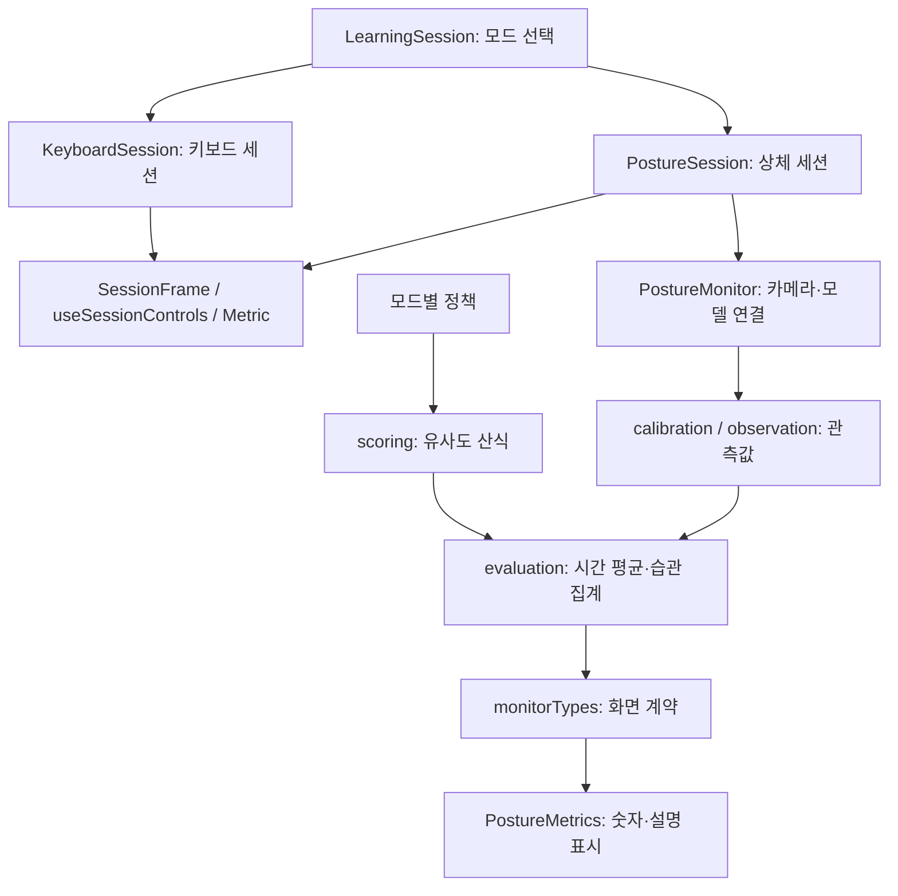

# 모드별 개발과 AI 협업

공통 화면은 공유하되 **모드 화면, 영상 분석, 점수 정책, 시간 집계, 표시 컴포넌트**를 분리합니다. 모든 화면을 복제하면 카메라·타이머 수정이 누락되기 쉽고, 한 파일에 모든 모드를 두면 서로 다른 작업도 같은 파일에서 충돌합니다. 공유할 것은 같은 책임이며, 모드별로 달라질 규칙은 각 모듈이 소유합니다.



## 수정할 파일을 먼저 고르기

| 작업 | 담당 경로 | 검증 |
| --- | --- | --- |
| 목 점수 지표·감점 기준 | `front/src/features/posture/modes/turtle.ts` | `posture-scoring.test.mjs`의 목 모드·격리 사례 |
| 어깨 점수 지표·감점 기준 | `front/src/features/posture/modes/shoulder.ts` | 같은 테스트의 어깨 모드·격리 사례 |
| 모든 상체 점수에 공통인 산식 | `front/src/features/posture/scoring.ts` | 양 모드 경계·누락·재현성 |
| 기준 수집·좌표 정의 | `front/src/features/posture/calibration.ts`, `observation.ts` | 수집/관측 회귀 검사, 실제 촬영 검증 |
| 시간 평균·연속 관찰·기준 이탈 | `front/src/features/posture/evaluation.ts` | `posture-evaluation.test.mjs` |
| 점수·습관 카드의 문구·디자인 | `front/src/features/posture/PostureMetrics.tsx` | `posture-metrics.test.mjs`, 실제 화면 확인 |
| 상체 시작/중지·재수집 화면 | `front/src/features/posture/PostureSession.tsx` | 상태 전환, 카메라 해제, 모드 이동 |
| 키보드 화면 | `front/src/features/keyboard/KeyboardSession.tsx` | 기존 키보드 계약 유지 |
| 카메라·모델 연결 | `front/src/components/PostureMonitor.tsx`, `front/src/hooks/` | 생명주기 검사와 실기기 검증 |
| 공통 틀·타이머·장치 선택 | `front/src/features/session/` | 목·어깨·키보드 화면 모두 확인 |

`LearningSession.tsx`는 모드 화면 선택만 합니다. 새 모드를 추가할 때 연결하고, 점수 산식이나 카드 문구를 바꿀 때는 수정하지 않습니다. 현재 목·어깨는 같은 카메라·랜드마크 추론과 상체 화면을 재사용합니다. 향후 전혀 다른 관측기가 필요할 때 해당 모드의 분석 모듈을 추가하면 됩니다.

React 상태도 책임에 맞춰 둡니다. 모드별 세션이 시작/중지와 결과 상태를 소유하고 공통 컴포넌트에 props를 전달합니다. `key={mode.id}`와 재시작의 `key={run}`은 이전 세션을 폐기합니다. 상태 소유와 재설정 방식은 [React의 상태 공유](https://react.dev/learn/sharing-state-between-components), [상태 유지와 재설정](https://react.dev/learn/preserving-and-resetting-state) 계약을 따릅니다.

## 여러 사람이 AI로 작업할 때

1. 사람/작업별 브랜치와 별도 체크아웃 또는 worktree를 사용합니다. 같은 폴더에서 여러 AI가 동시에 파일을 덮어쓰는 방식은 피합니다.
2. 작업 시작 전에 소유할 파일, 변경할 동작, 실행할 테스트를 적습니다. 다른 모듈 변경이 필요하면 연결 담당자에게 계약 변경으로 전달합니다.
3. `monitorTypes.ts`, 공통 세션 훅, 공통 산식, 잠금 파일은 한 작업에서 통합합니다. 여러 작업이 동시에 바꾸지 않습니다.
4. 좌표 의미를 바꾸면 calibration 문서, 점수 지표·임계값·산식을 바꾸면 해당 `scorePolicyVersion`, 습관 규칙을 바꾸면 `habitPolicyVersion`을 함께 갱신합니다. 산식 변경 시 그 산식을 쓰는 모든 모드 버전을 올립니다.
5. 각 작업의 테스트가 통과한 뒤 통합 담당자가 `moti.cmd check`와 프론트 빌드를 실행합니다. 통합 과정에서 기존 키보드나 다른 모드 변경을 통째로 되돌리지 않습니다.

예시 AI 작업 지시:

```text
README와 docs/collaboration.md, docs/evaluation.md를 읽어.
담당 파일은 front/src/features/posture/modes/shoulder.ts와 관련 점수 테스트야.
어깨 모드의 [변경 요구]를 구현해. 목 정책·카메라·공통 화면은 변경하지 마.
점수 정책 버전을 올리고 경계·누락·목 모드 비영향 테스트를 실행해.
다른 파일의 계약 변경이 필요하면 먼저 이유를 알려줘.
```

점수 수치의 의미와 현재 검증 범위는 [evaluation.md](evaluation.md)가 기준입니다. 파일을 나눴다는 사실이 측정 정확도나 의료적 타당성을 보장하지는 않습니다.
